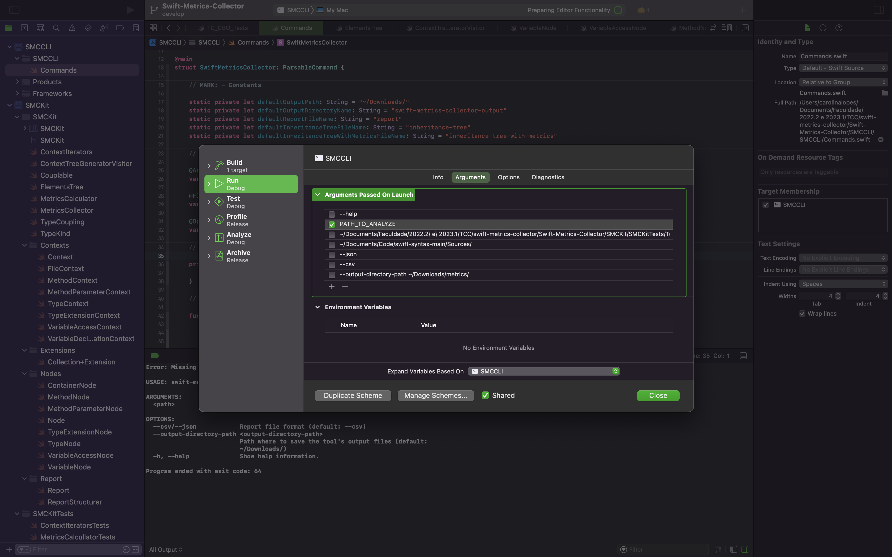

:toc: macro
:toc-title:
:toclevels: 2

= Swift Metrics Collector

toc::[]

== EN 🇬🇧

📊 A tool to collect some code metrics from code written in Swift ∙ (early 2023)

This is part of my graduating project.

=== Metrics

The metrics collected by the tool are inspired by the suite described in the link:https://www.doi.org/10.1109/32.295895[article "A Metrics Suite for Object Oriented Design" by Chidamber, S. and Kemerer, C.].

They are:

* Weighted Methods per Class (WMC)
* Number Of Childrem (NOC)
* Depth of Inheritance Tree (DIT)
* Lack of Cohesion in Methods (LCOM)
    ** This metric calculation differs from the one defined in the article by Chidamber and Kemerer. Instead, I decided to use the definition from the link:https://www.researchgate.net/publication/238729882_Measuring_coupling_and_cohesion_in_object-oriented_systems[article "Measuring coupling and cohesion in object-oriented systems" by Hitz, M. and Montazeri, B.].
* Response For a Class (RFC)
* Coupling Between Object classes (CBO)

=== Tool validation

I wrote a few test cases to validate the tool and implemented them as automated tests in Xcode. The test case descriptions are link:Casos_de_Teste[only available in portuguese] and their implementation is available on link:Swift-Metrics-Collector/SMCKit/SMCKitTests/Test%20Cases[Test Cases].

There's a variable used by the test cases that depends of the location of the project in yout machine. To configure this variable, use the template file `UserSettings_template.swift` localized at 'Swift-Metrics-Collector/SMCKit/SMCKitTests/'. You just have to create a new file named `UserSettings.swift` at this same location and copy the template content replacing `PATH_TO_REPO` with the repository's path on your machine.

[, swift]
----
enum UserSettings {
    static let projectPath = "PATH_TO_REPO/Swift-Metrics-Collector"
}
----

=== Limitations

There are some scenarios in which the tool doesn't calculate the metrics correctly. The known limitations are described with exemples in link:Limitacoes.adoc[Limitações] (descriptions only available in portuguese).

=== Usage

There's no built version of the tool, you have to use it throught Xcode for now.

This is a CLI tool Xcode project. The arguments and options are the following:

[, shell]
----
USAGE: swift-metrics-collector <path> [--csv] [--json] [--output-directory-path <output-directory-path>]

ARGUMENTS:
  <path>                  Path of the file or directory to be analyzed

OPTIONS:
  --csv/--json            Report file format (default: --csv)
  --output-directory-path <output-directory-path>
                          Path where to save the tool's output files (default:
                          ~/Downloads/)
  -h, --help              Show help information.
----

Before running the tool, use Xcode to edit the SMCCLI scheme and set the desired arguments.

== PT-BR 🇧🇷

📊 Uma ferramenta para coletar algumas métricas de código escrito em Swift ∙ (início de 2023)

Este projeto faz parte do meu Trabalho de Graduação.

=== Métricas

As métricas coletadas pela ferramenta foram inspiradas na suíte descrita no link:https://www.doi.org/10.1109/32.295895[artigo "A Metrics Suite for Object Oriented Design" de Chidamber, S. e Kemerer, C.].

Elas são (em tradução livre):

* Métodos ponderados por classe (Weighted Methods per Class - WMC)
* Número de filhos (Number Of Childrem - NOC)
* Profundidade da árvore de herança (Depth of Inheritance Tree - DIT)
* Falta de coesão em métodos (Lack of Cohesion in Methods - LCOM)
    ** O cálculo dessa métrica difere daquele definido no artigo de Chidamber e Kemerer. Em vez disso, eu decidi usar a definição do link:https://www.researchgate.net/publication/238729882_Measuring_coupling_and_cohesion_in_object-oriented_systems[artigo "Measuring coupling and cohesion in object-oriented systems" de Hitz, M. e Montazeri, B.].
* Resposta para uma classe (Response For a Class - RFC)
* Acoplamento entre classes de objeto (Coupling Between Object classes - CBO)

=== Validação da ferramenta

Escrevi alguns casos de teste para validar a ferramenta e implementei eles como testes automatizados no Xcode. Eles estão descritos em link:Casos_de_Teste[Casos de Teste] e implementados em link:Swift-Metrics-Collector/SMCKit/SMCKitTests/Test%20Cases[Test Cases].

Existe uma variável utilizada pelos casos de teste que depende da localização do projeto na sua máquina. Para configurar essa variável, use o arquivo de template `UserSettings_template.swift` localizado em 'Swift-Metrics-Collector/SMCKit/SMCKitTests/'. Basta criar um novo arquivo chamado `UserSettings.swift` neste mesmo local e copiar o conteúdo do template substituindo `PATH_TO_REPO` pelo caminho do repositório em sua máquina.

[, swift]
----
enum UserSettings {
    static let projectPath = "PATH_TO_REPO/Swift-Metrics-Collector"
}
----

=== Limitações

Existem alguns cenários em que a ferramenta não consegue calcular as métricas de forma correta. As limitações conhecidas estão descritas, com exemplos, em link:Limitacoes.adoc[Limitações].

=== Utilização

Ainda não existe uma versão buildada da ferramenta, você vai precisar usá-la através do Xcode por enquanto.

Esse é um projeto de uma ferramenta CLI. Os argumentos e opções são os seguintes:

[, shell]
----
USAGE: swift-metrics-collector <path> [--csv] [--json] [--output-directory-path <output-directory-path>]

ARGUMENTS:
  <path>                  Path of the file or directory to be analyzed

OPTIONS:
  --csv/--json            Report file format (default: --csv)
  --output-directory-path <output-directory-path>
                          Path where to save the tool's output files (default:
                          ~/Downloads/)
  -h, --help              Show help information.
----

Antes de rodar a ferramenta, use o Xcode para editar o scheme SMCCLI e setar os argumentos desejados.

